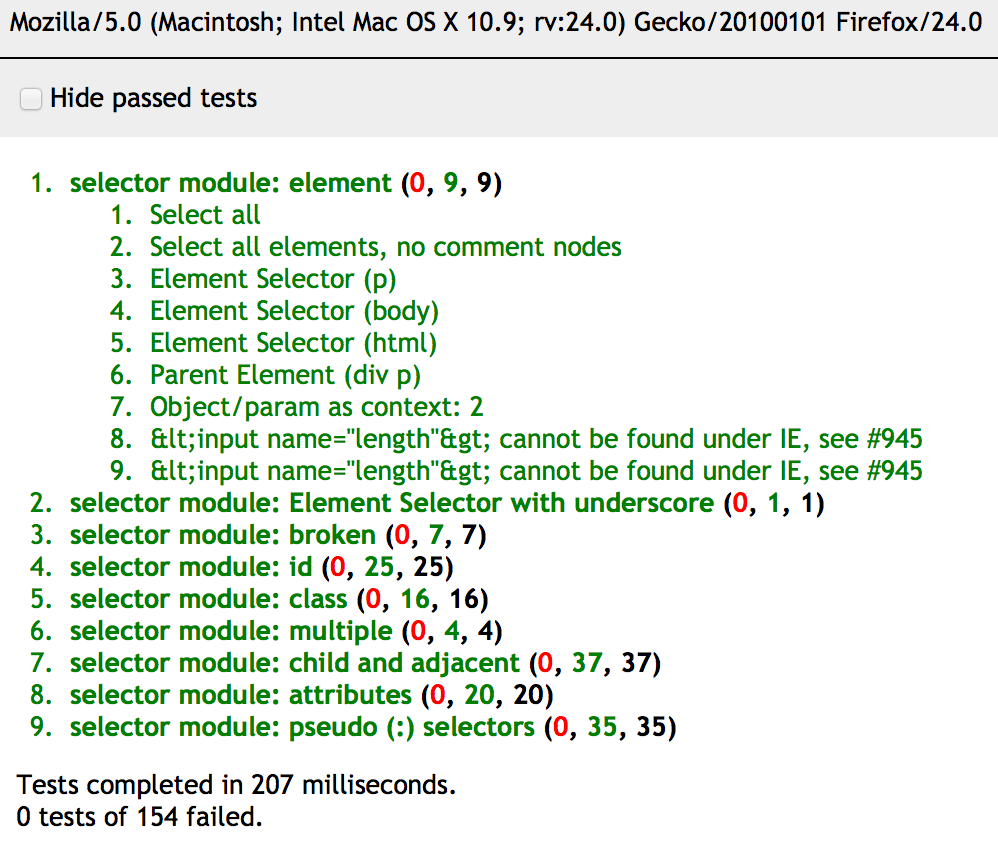

title: TDD in JS
author:
  name: Jonathan Reyes
  twitter: jreyes33
  url: http://jreyes.org
output: presentation.html
controls: false

--

# TDD in JS
## A lunch & learn session

--

### The xUnit way

QUnit

```javascript
test("should return the sum of all the numbers", function() {
  equal(10, calculator.sum([1, 2, 3, 4]));
});

test("`ok` works like `assertTrue` in JUnit", function() {
  ok([1, 2].length === 2, "a message in case it fails");
});
```

--

### The xUnit way

QUnit



--

### The BDD style

Mocha + Chai

```javascript
describe("calculator", function() {
  describe("sum", function() {
    it("should return the sum of all the numbers", function() {
      calculator.sum([1, 2, 3, 4]).should.equal('10');
    });
  });

  it("should not have a square root method", function() {
    should.not.exist(calculator.sqrt);
  });
});
```

--

### The BDD style

Jasmine

```javascript
describe("calculator", function() {
  describe("sum", function() {
    it("should return the sum of all the numbers", function() {
      expect(calculator.sum([1, 2, 3, 4])).toEqual('10');
    });
  });

  it("should not have a square root method", function() {
    expect(calculator.sqrt).toBeUndefined();
  });
});
```

--

### Jasmine

Setup and tear-down methods

```javascript
describe("calculator", function() {
  var calculator;

  beforeEach(function() {
    calculator = new Calculator();
  });

  // Some tests

  afterEach(function() {
    // Some tear-down operations
  });
});
```

--

### Jasmine

Spies (mocks and stubs)

```javascript
describe("currencyConverter", function() {
  it("should convert rupees to dollars", function() {
    spyOn(rates, 'getRate').and.returnValue(60);
    var result = currencyConverter.convert(20, 'dollar', 'rupee');
    expect(rates.getRate).toHaveBeenCalledWith('dollar', 'rupee');
    expect(result).toEqual(1200);
  });
});
```

--

### Jasmine jQuery

- `toBeVisible()`
- `toExist()`
- `toEqual(selector)`
- `toHaveClass(class)`
- `toHaveId(id)`
- `toHaveLength(length)`
- etc.

--

# Coding Time
